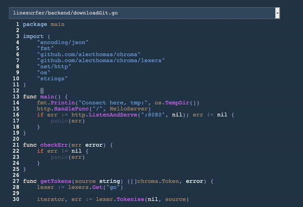

# Line Surfer

Surf on the lines

This is a thing that is supposed to optimize your
workflow when reading through code.

For now only some basic functionality is implemented.

# Attack Plan

- ~~Display small file.~~
- ~~Take files from HTTP.~~
- ~~Display one big file. (adapt viewport).~~
- ~~Color a file.~~
- ~~Display multiple files.~~
- Jump across files.

# Next release

- Go to usages.
- Add e and b movements.
- Add shift-a and shift-i
- Add gg and shift-G
